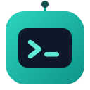

<div align="center">



# boss-agent-cli

*🤖 A local-assist BOSS Zhipin CLI for AI agents — search · welfare filtering · shortlist · JSON envelopes, low-risk by default.*

[](https://github.com/can4hou6joeng4/boss-agent-cli/actions/workflows/ci.yml)
[](https://codecov.io/gh/can4hou6joeng4/boss-agent-cli)
[](https://python.org)
[](LICENSE)
[](https://github.com/can4hou6joeng4/boss-agent-cli/releases)
[](https://pypi.org/project/boss-agent-cli/)
[](https://github.com/can4hou6joeng4/boss-agent-cli/pulls)

[Getting Started](docs/getting-started.en.md) · [Agent Integration](#-agent-integration) · [Commands](#-commands) · [Troubleshooting](docs/troubleshooting.en.md) · [Roadmap](ROADMAP.en.md) · [中文](README.md) | **English**

<a href="demo/showcase/boss-agent-cli-showcase.mp4" title="Watch the full project showcase video">
  
</a>

**[Watch the full showcase video](demo/showcase/boss-agent-cli-showcase.mp4)** · [terminal demo](demo/demo-en.gif) · schema-driven · welfare filtering · JSON envelope

</div>

<p align="center">
  <a href="https://www.atlascloud.ai/?utm_source=github&utm_medium=link&utm_campaign=boss-agent-cli">
    
  </a>
</p>

> 🎁 **[Atlas Cloud](https://www.atlascloud.ai/?utm_source=github&utm_medium=link&utm_campaign=boss-agent-cli)** gives `boss ai` a full-modal, OpenAI-compatible backend — one key for DeepSeek, Qwen, GLM, Kimi, MiniMax, Claude, GPT, and more, with no per-vendor wiring. Just pick `--provider atlas` in `boss ai config` (`base_url=https://api.atlascloud.ai/v1`, default model `deepseek-ai/deepseek-v4-pro`); see [AI model integration](docs/integrations/ai-models.en.md#atlas-cloud-one-key-across-many-model-families) for setup. Budget-friendly [coding plan](https://www.atlascloud.ai/console/coding-plan).

## 🧭 Why

Auto-apply and batch-greet scripts automate exactly what the platform doesn't want automated — a ban is only a matter of time. boss-agent-cli goes the other way: **it hands the low-risk, read-only, user-triggered part to your terminal and your agent, and leaves the sensitive actions (greeting, applying, messaging) for you to do by hand on the official site.** You describe intent; the agent searches, filters, and organizes candidate jobs into structured JSON. `boss schema` is the source of truth, so it drops straight into Claude / Cursor and other MCP hosts. Compliance isn't a patch — it's the default posture.

## ⚠️ Compliance Boundary

Assisted Mode is on by default: local assistance, read-only first, and user-triggered. Commands that greet (greet / batch-greet), apply, exchange contacts, search recruiter candidates, read candidate resumes / chats, or reply are blocked by default and return `COMPLIANCE_BLOCKED`; perform those actions manually on the official website. An explicit `boss config set operating_mode research` enables bounded browser-protocol, anti-debugging, risk-control adaptation, and controlled collection research, with redaction, checkpoints, stop controls, and auditable script provenance still required.

## ✨ Features

- **Job discovery**: keyword search + layered filters, with cached `show` navigation — `search` `show` `detail`
- **Welfare filtering (the differentiator)**: `--welfare "双休,五险一金"` pages, fetches details, runs **real AND matching**, and can `--sort score` by local match score — `search --welfare`
- **Local shortlist & stats**: inspect details, organize candidates with local tags and notes, compare jobs offline, and see funnel stats; apply and messaging stay on the official website — `shortlist` `stats` `watch` `preset`
- **AI job-hunting assist + local models**: JD analysis, resume polish, role-targeted optimization, keyword suggestions, resume optimization, shortlist fit reports, interview prep, chat coaching; local weights stay outside the Python package via Ollama/vLLM OpenAI-compatible endpoints — `ai analyze-jd` `ai suggest-keywords` `ai resume-optimize` `ai interview-prep` `ai chat-coach` `ai local configure` `ai local smoke`
- **Schema-first + JSON envelope**: stdout is a JSON-only `{ok, data, pagination, error, hints}` envelope, `boss schema` is the capability source of truth, and an **MCP server with 49 tools** exposes the low-risk and local task surface
- **Recruiter loop**: list and bring postings online / offline (`hr jobs list/online/offline`); candidate personal-data workflows are blocked by default
- **Cross-platform layer**: live `Platform` / `RecruiterPlatform` registries, `--platform zhipin|zhilian|qiancheng`

## 🚀 Quickstart

```bash
# Install (uv recommended; the browser core is only for user-triggered login / local export)
uv tool install boss-agent-cli
patchright install chromium

# Run the low-risk loop
boss doctor                                                   # environment check
boss login                                                    # user-triggered login (platform-aware chain)
boss status                                                   # verify login
boss search "Golang" --city 广州 --welfare "双休,五险一金"     # search + welfare filtering
boss detail <security_id>                                     # view detail
boss shortlist add <security_id> <job_id> --tags backend,remote  # add to local shortlist with local tags
boss shortlist compare --tag remote                           # compare shortlisted jobs offline
boss stats                                                    # local stats

# Recruiter mode (candidate-data workflows blocked by default)
boss hr jobs list
```

Every command outputs structured JSON (`ok` for success, `exit 0/1`). Full walk-through: [Getting Started](docs/getting-started.en.md).

## 🎭 Roles & Platforms

| Platform | Candidate | Recruiter | Status |
|----------|:--:|:--:|--------|
| BOSS Zhipin (`zhipin`) | ✅ | ✅ | default |
| Zhaopin (`zhilian`) | ✅ candidate-side read-only + local-assist parity | 🟡 `agent` browser/CDP automation V1 | `hr` remains BOSS-only; Zhaopin recruiter automation uses `boss --platform zhilian --role recruiter agent ...` |
| 51job (`qiancheng`) | 🚧 registered placeholder | — | returns `NOT_SUPPORTED` until the read-only research gate is satisfied |

```bash
boss --platform zhilian search "Python"   # pick a platform (also --platform zhipin|zhilian|qiancheng)
boss config set platform zhilian          # set as default
```

`boss hr ...` currently supports only the default recruiter platform `zhipin-recruiter`; Zhaopin recruiter automation is exposed through `agent` and the browser/CDP adapter. Architecture notes: [docs/platform-abstraction.en.md](docs/platform-abstraction.en.md).

## 🤖 Agent Integration

Start here: [Agent Quickstart](docs/agent-quickstart.en.md) · [Capability Matrix](docs/capability-matrix.en.md) · [Host Examples](docs/agent-hosts.en.md)

```json
// Option 1: MCP (recommended) — Claude Desktop / Cursor and other MCP hosts; MCP server with 49 tools
{ "mcpServers": { "boss-agent": { "command": "uvx", "args": ["--from", "boss-agent-cli[mcp]", "boss-mcp"] } } }
```

OpenCode can use the checked-in example directly:

```bash
cp examples/opencode/opencode.json ./opencode.json
uv sync --all-extras
uv run boss-mcp --data-dir ./.boss-agent --help
```

After portable/global install, copy the bundle's `examples/opencode.json` into any
OpenCode project. It starts `boss-mcp --data-dir ./.boss-agent`, keeping review,
pending, and logs project-local.

```bash
# Option 2: subprocess — let the Agent read the self-description, then parse stdout JSON
boss schema
```

```python
# Option 3: embed in Python (ships with py.typed)
from boss_agent_cli import AuthManager, BossClient, AuthRequired
with BossClient(AuthManager(...)) as client:
    result = client.search_jobs("Golang", city="北京")
```

## 📚 Commands

`boss schema` exposes 37 top-level commands + 9 first-level recruiter subcommands, grouped by workflow:

- **Auth**: `login` · `logout` · `status` · `doctor`
- **Discover**: `search` · `detail` · `show` · `cities` · `history`
- **Organize**: `watch` · `preset` · `shortlist` · `stats`
- **Restricted research crawl**: `crawl configure/run/start/status/results/resume/stop/shortlist` (explicit `operating_mode=research` only; MCP only reads or locally imports an existing run)
- **Resume / AI**: `resume` · `me` · `ai analyze-jd` · `ai polish` · `ai optimize` · `ai fit` · `ai suggest-keywords` · `ai resume-optimize` · `ai cover-letter` · `ai interview-prep` · `ai chat-coach` · `ai local`
- **Utility**: `schema` · `platforms` · `export` · `config` · `clean`
- **Recruiter**: `hr jobs list/online/offline`
- **Restricted (blocked by default in low-risk mode)**: `greet` · `batch-greet` · `apply` · `exchange` · `chat*` · `pipeline` · `digest`

Full command tables, parameters, and welfare-matching internals: **[Command Reference](docs/commands.en.md)**. The capability source of truth is `boss schema` (with `--format openai-tools` / `anthropic-tools` exports).

Bulk crawl requires `uv sync --extra crawl`. It runs only in explicit `operating_mode=research` mode, creates and cleans up its own `<data-dir>/crawl/chrome-profile`, and never attaches to a daily Chrome profile. Hooks are disabled by default; if you have authorized local scripts, explicitly provide both the profile and a directory containing `SHA256SUMS`:

```powershell
boss crawl configure --max-requests 20 --max-details 50 --max-seconds 600 --max-retries 1
boss crawl run "AI" --city 杭州 --pages 3 --with-detail `
  --hook-profile screenshot-full --hook-dir E:\boss-agent-cli-local-hooks\AntiDebug_Breaker
boss crawl resume <run_id>
boss crawl stop <run_id>
boss agent crawl --run-id <run_id> --resume <resume-name>
```

`crawl run` is sequential, checkpoints SQLite state, and incrementally writes JSON / CSV / XLSX artifacts. Request, detail, wall-clock, and retry budgets are fixed; `boss crawl stop` stops at the next safe point. Exports and `crawl results` redact `security_id`, selectors, and recruiter fields; `boss clean --privacy` removes crawl state, budgets, and exports. MCP remains assisted-only and can only use `crawl_status`, `crawl_results`, and `crawl_shortlist` to read or locally import an existing `run_id`; creating, resuming, and stopping runs stays in the explicitly enabled Research Mode CLI. A platform risk code or security page stops the task and returns a resume command. `boss agent crawl --run-id` only analyzes a completed run; a new real-Chrome crawl requires `operating_mode=research` and `--allow-crawl`.

## 🩺 Troubleshooting

```bash
boss doctor             # environment check
boss status --live      # optional low-frequency read-only probe
boss doctor --live-probe
```

Every error envelope carries `code` + `recoverable` + `recovery_action`, so agents can react programmatically. Browser Bridge local diagnostics cover `bridge_daemon` / `bridge_extension` / `bridge_protocol` / `bridge_workspace` / `bridge_exec` / `bridge_fetch` / `bridge_navigate`; start the daemon with `python -m boss_agent_cli.bridge.daemon --serve`. Assisted Mode stops on platform risk-control blocks. Research Mode may run declared adapters, but work must remain bounded, checkpointed, redacted, and explicitly resumed by the user.

Full checks, CDP launch examples, and error codes: **[Troubleshooting](docs/troubleshooting.en.md)**. For Cookie / CDP / patchright / request-rate / drift issues, read [Platform Risk Boundaries](docs/platform-risk.en.md) first.

## ⚙️ Configuration

```bash
boss config list                      # view all settings
boss config set log_level debug       # set the log level
boss config reset                     # restore defaults
```

Settings live in `~/.boss-agent/config.json`: request delays, batch-greet delay, log level, CDP URL, export dir, platform / role.

## 🏗️ Architecture

```
CLI (Click)
  └─ Compliance Guardrails (low-risk by default; blocks sensitive writes & candidate personal-data flows)
       └─ AuthManager ── user-triggered login state (Fernet + PBKDF2 machine-bound encryption)
       └─ Platform registries ── zhipin / zhilian / qiancheng placeholder
       └─ BossClient ── httpx + throttle; CDP / Bridge / patchright compatible for login & export
       └─ CacheStore (SQLite WAL) · AIService (OpenAI-compatible / Ollama / vLLM)
            └─ output.py → JSON envelope → stdout
```

**Invariants**: stdout is JSON-only · stderr holds logs · `exit 0/1` · errors carry `code/recoverable/recovery_action` · `boss schema` is the authoritative capability source. **Stack**: Python ≥ 3.10 · Click · httpx · patchright / CDP / Bridge (login, export, and explicit Research Mode adapters) · cryptography · sqlite3 (WAL) · pytest (1400+).

## 🔌 Local Storage

All state lives under `~/.boss-agent/` — encrypted tokens, cached searches, shortlist, local resumes, AI config, and external model registry. Model weights are not bundled into the Python package; nothing leaves your machine except explicit API calls or user-confirmed model downloads.

## 🤝 Contributing

See [CONTRIBUTING.en.md](CONTRIBUTING.en.md) and [Getting Started](docs/getting-started.en.md). TL;DR: fork → `feat/xxx` branch → write tests → `python scripts/quality_baseline.py` (on Chinese Windows, set `$env:PYTHONUTF8='1'` first) → PR.

<a href="https://github.com/can4hou6joeng4/boss-agent-cli/graphs/contributors"></a>

If this project helps you, a [Star ⭐](https://github.com/can4hou6joeng4/boss-agent-cli) or a share goes a long way.

## ⚠️ Disclaimer

This project is for learning and local assistance only; follow applicable laws, the BOSS Zhipin user agreement, and its privacy policy. Default low-risk mode blocks automated outreach, bulk actions, risk-control bypass, and candidate personal-data workflows; any apply, messaging, contact exchange, or recruiter candidate handling should be completed manually on the official website.

## 📑 License & Communities

[MIT](LICENSE) © [can4hou6joeng4](https://github.com/can4hou6joeng4) · [LINUX DO](https://linux.do/)
